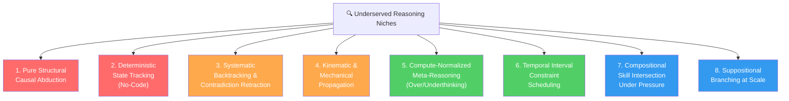

# AI Reasoning & Problem-Solving Benchmarks: Landscape Report & New Directions

> **Prepared:** October 2026 | **Scope:** Narrow-focus AI reasoning/problem-solving benchmarks (2024–2026) | **Purpose:** Inform the design of a new niche AI evaluation benchmark

---

## 1. The Big Picture: Why Narrow Benchmarks Now?

The 2024–2026 period represents an **inflection point** in AI evaluation. Three forces are driving a paradigm shift toward narrow, diagnostic benchmarks:

| Force | What Happened |
|:---|:---|
| **Legacy Saturation** | GSM8K (99%), MATH (96%), MMLU (90%+), GPQA Diamond (88–96%), HumanEval (90%+) have all lost discriminative signal |
| **The Brittleness Paradox** | Models solve PhD-level competition problems via massive test-time compute, yet collapse on trivial character-counting, spatial orientation, or basic syllogistic variations |
| **Scaffolding Inflation** | Top benchmark scores increasingly reflect agentic wrappers (MCTS, program synthesis, ensemble voting) rather than the foundational reasoning model itself |

> [!IMPORTANT]
> The community consensus is clear: **monolithic, static, outcome-only benchmarks are dead.** The future belongs to procedurally generated, process-supervised, compute-normalized, narrow-skill diagnostics.

---

## 2. Landscape of Existing Narrow-Focus Benchmarks (2024–2026)

### 2.1 Constraint Satisfaction & Formal Logic

| Benchmark | Year / Venue | Focus | SOTA Score | Saturation |
|:---|:---|:---|:---|:---|
| [**ZebraLogic**](https://arxiv.org/abs/2502.01100) | 2025 / ICML | Logic grid puzzles scaling 2×2 → 6×6 | 70–75% (o1/R1); <20% on 6×6 | ❌ Unsaturated |
| [**TruthQuest**](https://aclanthology.org/2024.emnlp-main.574/) | 2024 / EMNLP | Knights & Knaves suppositional reasoning | 70–82% (o1/R1); collapses on 5+ agents | ⚠️ Partial |
| [**PlanBench**](https://arxiv.org/abs/2206.10498) | 2023–24 / NeurIPS | PDDL planning + obfuscated semantics | Standard: ~80%, Obfuscated: ~30% | ❌ Unsaturated (obfuscated) |

**Key insight:** Performance drops exponentially with problem size, proving models lack systematic backtracking. Semantic obfuscation causes catastrophic collapse (~85–90% drop), revealing reliance on memorized heuristics over genuine symbolic reasoning.

---

### 2.2 Mathematical Reasoning (Elementary → Research-Level)

| Benchmark | Year | Focus | SOTA Score | Saturation |
|:---|:---|:---|:---|:---|
| **GSM8K** | Legacy | Grade-school math | 96–99% | ✅ Saturated |
| **MATH** | Legacy | Competition math (high school) | 94–96% | ✅ Saturated |
| **AIME 2024/25** | 2024–25 | National olympiad | 83–93% (o1/R1) | ⚠️ Near saturated |
| [**GSM-Symbolic**](https://arxiv.org/abs/2410.05229) | 2024 / Apple | Perturbation invariance & distractor sensitivity | Up to 65% collapse with irrelevant clauses | ❌ Exposes fragility |
| [**FrontierMath**](https://arxiv.org/abs/2411.04872) | 2024 / Epoch AI | Original research-level math (number theory, algebraic geometry) | <2% base; ~25% o3 | ❌ Unsaturated |
| [**PutnamBench**](https://arxiv.org/abs/2407.11214) | 2024 / NeurIPS | Formal theorem proving (Lean 4, Isabelle) | <1% zero-shot; 10–40% proof agents | ❌ Unsaturated |

**Key insight:** GSM-Symbolic proved that "saturated" GSM8K scores are illusory — adding a single irrelevant sentence collapses accuracy by up to 65%. Models match templates, not mathematics.

---

### 2.3 Spatial & Physical Reasoning

| Benchmark | Year / Venue | Focus | SOTA Score | Saturation |
|:---|:---|:---|:---|:---|
| [**SPACE**](https://arxiv.org/abs/2410.06468) | 2025 / ICLR | Multi-scale spatial cognition & navigation | 15–35% (≈ random chance) | ❌ **Completely unsolved** |
| [**Mind the Gap**](https://arxiv.org/abs/2503.19707) | 2025 / arXiv | 3D mental rotation (Shepard-Metzler style) | 25–35% across 13 VLMs | ❌ **Completely unsolved** |
| [**SpatiaLQA**](https://arxiv.org/abs/2501.00000) | 2026 / CVPR | Multi-step spatial dependencies in 3D scenes | Poor for standard VLMs | ❌ Unsaturated |
| [**BLINK**](https://arxiv.org/abs/2404.12390) | 2024 / ECCV | Fast visual-spatial perception (depth, multi-view) | 45–55% (vs. 95% human) | ❌ Unsaturated |
| **PhysReason / PhysBench** | 2025 | Physical dynamics & mechanics | Moderate | ❌ Unsaturated |

> [!CAUTION]
> **Spatial reasoning is the single weakest capability across all frontier models.** Scores are at or below random chance on mental rotation, path integration, and navigation tasks — skills that even rodents perform effortlessly.

---

### 2.4 Causal & Counterfactual Reasoning

| Benchmark | Year / Venue | Focus | SOTA Score | Saturation |
|:---|:---|:---|:---|:---|
| [**CounterBench**](https://arxiv.org/abs/2502.11008) | 2025 / arXiv | Pearl Level-3 structural counterfactuals (SCMs) | Near random on nested/conditional queries | ❌ **Completely unsolved** |
| [**CauSciBench**](https://arxiv.org/abs/2410.21717) | 2025–26 / ICML | End-to-end scientific causal inference | 15–28% on real studies | ❌ **Completely unsolved** |
| [**ExpliCa**](https://aclanthology.org/) | 2025 / ACL | Causality vs. temporal sequence disambiguation | High error on framing inversions | ❌ Unsaturated |
| **CausalBench / CausalGame** | 2024–25 | Interactive causal graph discovery | Moderate | ❌ Unsaturated |

**Key insight:** Models confuse temporal succession with causation (*post hoc ergo propter hoc*), cannot execute the abduction step in counterfactual queries, and default to OLS regression when real scientific causal methods are needed.

---

### 2.5 Procedural & State-Tracking Reasoning

| Benchmark | Year | Focus | SOTA Score | Saturation |
|:---|:---|:---|:---|:---|
| [**CRUXEval**](https://arxiv.org/abs/2401.03065) | 2024 / ICML | Mental code execution (forward & backward) | Output: ~92%, Input: ~85% | ⚠️ Approaching |
| **SVAC** | 2024–25 | OS algorithm step-tracing (no code tools) | Low without tools | ❌ Unsaturated |
| **PetriBench** | 2024–25 | Petri net / FSM state-space execution | Low | ❌ Unsaturated |
| [**MuSR**](https://arxiv.org/abs/2310.16049) | 2024 / ICLR | Multi-step soft reasoning in narratives | 60–72% (vs. 85–90% human) | ❌ Unsaturated |

**Key insight:** Models generate convincing procedural explanations but fail when forced to execute algorithms step-by-step without a code interpreter. A single early error cascades irrecoverably.

---

### 2.6 Compositional, Analogical & Long-Context Reasoning

| Benchmark | Year / Venue | Focus | SOTA Score | Saturation |
|:---|:---|:---|:---|:---|
| [**AnaloBench**](https://arxiv.org/abs/2402.12370) | 2024 / EMNLP | Cross-domain structural analogy | 52–63% (vs. >88% human) | ❌ Unsaturated |
| [**AgentCoMa**](https://arxiv.org/abs/2502.04300) | 2025 / ACL | Commonsense + math composition in agents | ~30% degradation when combined | ❌ Unsaturated |
| [**RECON**](https://arxiv.org/abs/2607.16716) | 2026 / arXiv | Long-context compositional memory & evidence invalidation | ~22.4% top model | ❌ **Completely unsolved** |

**Key insight:** The "Compositionality Gap" — models solve each sub-skill in isolation at >85%, but performance degrades ~30% when skills must be combined in unified tasks.

---

### 2.7 Strategic & Game-Theoretic Reasoning

| Benchmark | Year | Focus | SOTA Score | Saturation |
|:---|:---|:---|:---|:---|
| **GTBench** | 2024 | Game-theoretic reasoning across 11 games | Frequent strategic blunders | ❌ Unsaturated |
| **PokerBench** | 2025 | Imperfect-info poker (Level-k, GTO play) | Exploitable heuristic play | ❌ Unsaturated |

---

### 2.8 Frontier "Ceiling" Benchmarks

| Benchmark | Year | Focus | SOTA Score | Saturation |
|:---|:---|:---|:---|:---|
| [**Humanity's Last Exam**](https://arxiv.org/abs/2501.14249) | 2025 / CAIS+Scale AI | PhD-level, Google-proof, 100+ subjects | 60–65% (from ~3% at launch) | ❌ Active ceiling |
| **ARC-AGI-2 / 3** | 2025–26 | Multi-rule compositional fluid intelligence | <25% baseline | ❌ Unsaturated |

---

## 3. Gap Analysis: Where Are the Biggest Voids?

Based on the full landscape survey, here are the **most underserved reasoning niches** — areas with either no dedicated benchmark, inadequate existing evaluation, or fundamental unsolved problems:

### 3.1 🔴 Critical Voids (No adequate benchmark exists)

| Niche | Gap Description | Why It Matters |
|:---|:---|:---|
| **Pure Structural Causal Abduction** | No benchmark isolates the abduction step (inferring latent exogenous variables $U$ from evidence) with fully anonymized, non-semantic DAGs. Existing causal benchmarks let models exploit world-knowledge shortcuts | Tests whether models truly reason about causation or merely pattern-match familiar causal narratives |
| **Deterministic State Tracking (No-Code)** | No benchmark forces models to trace register/memory states through a virtual machine without access to a code interpreter. Existing code benchmarks allow tool-assisted execution | Isolates the neural network's intrinsic sequential state-tracking capacity from its code-generation ability |

### 3.2 🟠 Major Gaps (Partial benchmarks exist, but are insufficient)

| Niche | Gap Description | What's Missing |
|:---|:---|:---|
| **Systematic Backtracking & Contradiction Retraction** | ZebraLogic exposes the failure, but doesn't evaluate the *process* of identifying dead ends, retracting assumptions, and switching branches | A benchmark that forces greedy heuristics to fail at a known depth, then grades the model's backtracking behavior step-by-step |
| **Kinematic & Mechanical Chain Propagation** | PhysReason/PhysBench test undergraduate physics, but not multi-stage kinematic linkages (gears, pulleys, four-bar mechanisms) with perturbation queries | Eliminates 50/50 guessing by requiring quantitative direction, velocity ratio, and degrees-of-freedom computation across randomized topologies |

### 3.3 🟢 Emerging Opportunities (Early work exists, ripe for a definitive benchmark)

| Niche | Gap Description | Opportunity |
|:---|:---|:---|
| **Compute-Normalized Meta-Reasoning** | Models either overthink (bloating tokens, flipping correct answers) or underthink (jumping to conclusions). No benchmark dual-penalizes both failure modes relative to optimal token budget | A "Calibrated Stopping-Rule" benchmark could transform how we measure reasoning efficiency, not just accuracy |
| **Temporal Interval Constraint Scheduling** | ChronoSense and TRACEBench exist but rely on Wikipedia lookups. No benchmark tests pure synthetic Allen's Interval Algebra with incomplete information and satisfiability checking | Procedurally generated scheduling problems with randomized durations and relational constraints |

### 3.4 🔵 Novel Frontier Directions

| Niche | Description |
|:---|:---|
| **Compositional Skill Intersection Under Pressure** | AgentCoMa showed the compositionality gap exists; a benchmark could systematically vary the *number and type* of intersecting skills (math × commonsense × spatial × temporal) to map the degradation curve |
| **Suppositional Branching at Scale** | TruthQuest (Knights & Knaves) shows collapse at 5+ agents; a benchmark could generalize suppositional branching to arbitrary domains (legal hypotheticals, counterfactual histories, multi-world physics) |

---

## 4. Suggested Directions for Your Benchmark Project

Based on the gap analysis, here are **8 concrete benchmark directions** ranked by novelty, feasibility, and impact:

---

### Direction 1: **BacktrackBench** — Systematic Contradiction Detection & Retraction
> *"Can a model recognize it's stuck, find the bad assumption, and fix it?"*

- **What it tests:** Combinatorial backtracking — the ability to detect dead ends, identify the faulty branch point, retract conflicting assignments, and explore alternatives
- **Design:** CSP / logic puzzle instances engineered so that greedy forward heuristics are *guaranteed* to fail at a known depth $D$. Grade models on: (1) detecting the contradiction, (2) identifying the specific faulty assumption, (3) retracting it, (4) finding the correct path
- **Why it's novel:** ZebraLogic shows models fail; BacktrackBench would diagnose *why* and *where* in the reasoning process
- **Feasibility:** ⭐⭐⭐⭐⭐ (fully synthetic, procedurally generated, auto-verifiable)
- **Contamination resistance:** ⭐⭐⭐⭐⭐ (infinite instances)

---

### Direction 2: **ByteTrace** — Deterministic Register Machine Tracing (No-Code)
> *"Can a model mentally execute a CPU without writing Python?"*

- **What it tests:** Internal neural state-tracking capacity, completely decoupled from code generation ability
- **Design:** A synthetic 8-instruction micro-VM (LOAD, STORE, ADD, SUB, MUL, CMP, JMP, HALT). Models must output the exact register/memory state vector after every single clock cycle. No code interpreter access
- **Why it's novel:** CRUXEval tests code reasoning *with* CoT execution traces; ByteTrace tests whether the model *itself* can be the computer
- **Feasibility:** ⭐⭐⭐⭐⭐ (trivially auto-verifiable, procedurally generated)
- **Contamination resistance:** ⭐⭐⭐⭐⭐

---

### Direction 3: **AbductionBench** — Pure Structural Causal Abduction
> *"Can a model infer hidden causes from observed effects in an anonymous causal graph?"*

- **What it tests:** Pearl Level-3 reasoning with fully anonymized nodes ($A, B, C, U_1, U_2$), requiring explicit: (1) posterior inference of latent exogenous variables, (2) graph modification under $\text{do}(X)$, (3) counterfactual numerical computation
- **Design:** Synthetic SCMs with varying complexity (3–10 nodes, linear/nonlinear functions, binary/continuous variables). All variables stripped of semantic meaning
- **Why it's novel:** CounterBench uses some real-world framing; this benchmark eliminates *all* semantic shortcuts, testing pure structural causal reasoning
- **Feasibility:** ⭐⭐⭐⭐ (requires careful formal verification of ground truth via symbolic computation)
- **Contamination resistance:** ⭐⭐⭐⭐⭐

---

### Direction 4: **ThinkBudget** — Compute-Normalized Meta-Reasoning Efficiency
> *"Does the model know when to stop thinking?"*

- **What it tests:** The ability to calibrate reasoning effort to task difficulty — dual-penalizing both underthinking (wrong answer) and overthinking (excessive tokens on easy problems)
- **Design:** A spectrum of problems from trivial to very hard. Score = $f(\text{accuracy}, \text{tokens\_used}, \text{optimal\_tokens})$. Models that solve easy problems with 5,000 tokens or fail hard problems after only 50 tokens are both penalized
- **Why it's novel:** Every existing benchmark rewards only accuracy. This is the first to measure *reasoning efficiency* as a first-class metric
- **Feasibility:** ⭐⭐⭐⭐ (requires careful calibration of "optimal" token budgets)
- **Contamination resistance:** ⭐⭐⭐⭐

---

### Direction 5: **KinemaBench** — Qualitative Mechanical Chain Reasoning
> *"If Gear A turns clockwise, what happens to Pulley F when Link C is removed?"*

- **What it tests:** Motion propagation through multi-stage mechanical assemblies (gear trains, four-bar linkages, pulley systems) including perturbation queries ("what if component X is removed/jammed?")
- **Design:** Procedurally generated 2D mechanical assemblies with randomized topologies. Queries require: (1) direction of motion, (2) relative velocity ratios, (3) degrees of freedom, (4) jamming/stress predictions
- **Why it's novel:** PhysReason tests textbook physics; KinemaBench tests *mechanical intuition* over novel, unseen assemblies — a skill fundamental to engineering and robotics
- **Feasibility:** ⭐⭐⭐ (requires a mechanical simulation engine for ground truth)
- **Contamination resistance:** ⭐⭐⭐⭐⭐

---

### Direction 6: **IntervalSAT** — Allen's Interval Constraint Scheduling
> *"Can these 7 meetings fit into this calendar with these overlap constraints?"*

- **What it tests:** Temporal constraint satisfaction using Allen's 13 interval relations, with incomplete information and satisfiability checking
- **Design:** Synthetic scheduling problems: $N$ events with randomized durations, qualitative relational constraints expressed in natural language. Model must determine satisfiability and produce valid schedule coordinates $[t_{\text{start}}, t_{\text{end}}]$
- **Why it's novel:** ChronoSense relies on Wikipedia date lookups; this tests *pure temporal constraint reasoning* with no factual shortcuts
- **Feasibility:** ⭐⭐⭐⭐⭐ (auto-verifiable via constraint solver)
- **Contamination resistance:** ⭐⭐⭐⭐⭐

---

### Direction 7: **ComposeStress** — Compositional Skill Intersection Under Load
> *"What happens when math, commonsense, spatial, and temporal reasoning must all fire at once?"*

- **What it tests:** Systematic mapping of the "Compositionality Gap" — how performance degrades as the number of intersecting reasoning skills increases from 1 → 2 → 3 → 4+
- **Design:** Modular problem generator that composes atomic reasoning modules (arithmetic, spatial relations, temporal ordering, commonsense physics, logical deduction). Each problem is tagged with which skills are required, enabling fine-grained degradation analysis
- **Why it's novel:** AgentCoMa showed the gap exists for 2-skill intersections; this benchmark maps the full degradation surface across arbitrary skill combinations
- **Feasibility:** ⭐⭐⭐ (designing clean skill-orthogonal modules requires careful calibration)
- **Contamination resistance:** ⭐⭐⭐⭐

---

### Direction 8: **BranchWorld** — Suppositional Branching Across Domains
> *"In a world where gravity is reversed, what happens to this Rube Goldberg machine?"*

- **What it tests:** Reasoning under hypothetical assumption changes across arbitrary domains — not just Knights/Knaves, but legal hypotheticals, counterfactual physics, alternative histories, and multi-world branching
- **Design:** Scenarios where one or more foundational assumptions are modified. Model must trace all downstream implications through a causal/logical dependency graph. Ground truth verified via formal dependency analysis
- **Why it's novel:** TruthQuest showed suppositional reasoning collapses at scale but only in one domain; this generalizes to arbitrary suppositional branching
- **Feasibility:** ⭐⭐⭐ (ground truth verification for open-domain counterfactuals is challenging)
- **Contamination resistance:** ⭐⭐⭐⭐

---

## 5. Design Principles for a High-Impact Narrow Benchmark

Based on lessons from the 2024–2026 benchmark landscape, any new benchmark should embody these principles:

> [!TIP]
> ### The 7 Commandments of Modern Benchmark Design
> 1. **Procedural Generation** — Produce infinite novel instances with guaranteed ground truth. Static test sets decay within 12–18 months
> 2. **Process Supervision** — Grade intermediate reasoning steps, not just final answers. Use formal verifiers (Z3, Lean, SAT solvers) where possible
> 3. **Compute Normalization** — Report scores per token budget. A model that uses 25,000 reasoning tokens to solve what should take 500 is not "better"
> 4. **Semantic Stripping** — Include anonymized/obfuscated variants to test genuine reasoning vs. memorized heuristics (lesson from PlanBench's Mystery Blocksworld)
> 5. **Difficulty Scaling** — Parameterize difficulty continuously (grid size, constraint count, chain depth) to map degradation curves, not just point estimates
> 6. **Anti-Scaffolding Controls** — Report both tool-assisted and tool-free performance to separate the model's reasoning from its code-generation ability
> 7. **Dual-Metric Scoring** — Measure both accuracy AND efficiency (tokens, latency, cost) to avoid rewarding brute-force test-time compute inflation

---

## 6. Quick-Reference: All Benchmarks Mentioned

| Benchmark | Year | Venue | Narrow Skill | Status |
|:---|:---|:---|:---|:---|
| ZebraLogic | 2025 | ICML | Constraint satisfaction (grid puzzles) | ❌ Unsaturated |
| TruthQuest | 2024 | EMNLP | Suppositional reasoning (Knights & Knaves) | ⚠️ Partial |
| PlanBench | 2023–24 | NeurIPS | PDDL planning + semantic obfuscation | ❌ Unsaturated |
| GSM-Symbolic | 2024 | arXiv (Apple) | Math perturbation invariance | ❌ Exposes fragility |
| FrontierMath | 2024 | Epoch AI | Research-level mathematics | ❌ Unsaturated |
| PutnamBench | 2024 | NeurIPS | Formal theorem proving (Lean 4) | ❌ Unsaturated |
| SPACE | 2025 | ICLR | Multi-scale spatial cognition | ❌ Unsolved |
| Mind the Gap | 2025 | arXiv | 3D mental rotation | ❌ Unsolved |
| SpatiaLQA | 2026 | CVPR | 3D spatial dependency reasoning | ❌ Unsaturated |
| BLINK | 2024 | ECCV | Visual-spatial perception | ❌ Unsaturated |
| CounterBench | 2025 | arXiv | Pearl L3 structural counterfactuals | ❌ Unsolved |
| CauSciBench | 2025–26 | ICML | Scientific causal inference | ❌ Unsolved |
| ExpliCa | 2025 | ACL | Causality vs. temporal sequence | ❌ Unsaturated |
| CRUXEval | 2024 | ICML | Code mental execution | ⚠️ Approaching |
| MuSR | 2024 | ICLR | Multi-step soft narrative reasoning | ❌ Unsaturated |
| SVAC | 2024–25 | arXiv | OS algorithm step-tracing | ❌ Unsaturated |
| AnaloBench | 2024 | EMNLP | Cross-domain analogical reasoning | ❌ Unsaturated |
| AgentCoMa | 2025 | ACL | Commonsense + math composition | ❌ Unsaturated |
| RECON | 2026 | arXiv | Long-context compositional memory | ❌ Unsolved |
| GTBench | 2024 | arXiv | Game-theoretic reasoning | ❌ Unsaturated |
| PokerBench | 2025 | arXiv | Imperfect-info strategic play | ❌ Unsaturated |
| Humanity's Last Exam | 2025 | CAIS/Scale AI | PhD-level multi-disciplinary | ❌ Active ceiling |
| ARC-AGI-2/3 | 2025–26 | ARC Prize | Fluid intelligence | ❌ Unsaturated |
| MMLU-Pro | 2024 | NeurIPS | 10-choice graduate reasoning | ⚠️ Near saturated |
| GPQA Diamond | 2024 | COLM | PhD-level science QA | ✅ Saturated |
| PhysReason | 2025 | arXiv | Physical dynamics | ❌ Unsaturated |
| LiveBench | 2024– | Ongoing | Monthly-refreshed multi-task | ❌ Dynamic |
| ReasonBENCH | 2025 | arXiv | Reasoning stability & variance | ❌ Unsaturated |

---

## 7. Recommended Next Steps

1. **Pick 1–2 directions** from Section 4 that align with your team's expertise and interest
2. **Prototype a generator** — Build a small procedural instance generator (even 50–100 instances) and pilot-test on 3–4 frontier models to validate discriminative signal
3. **Define your scoring rubric** early — Decide whether you're grading process or outcome (or both), and whether compute-normalization matters to your thesis
4. **Run a contamination audit** — Verify your generated instances don't closely resemble any existing training data by testing with and without semantic obfuscation
5. **Consider a "living benchmark"** format — A generator that produces fresh instances on demand (like LiveBench) rather than a static test set

> [!NOTE]
> The highest-impact benchmarks of the last two years share one trait: they revealed a **specific, surprising failure mode** that contradicted the narrative of benchmark scores. GSM-Symbolic showed "solved" math benchmarks were illusory. SPACE showed spatial reasoning is at chance. PlanBench's Mystery Blocksworld showed planning was memorization. Your benchmark should aim for a similarly crisp, surprising finding.
